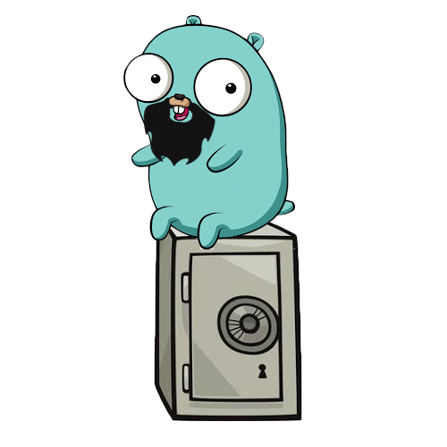

# Secret Safe in Go!!!



Small CLI application project that stores secrets inside super secure Vault.  Created mainly for Go language learning purpose.

Usage:
* Pull the code
* (Optionally) Build the CLI.go
* Run it with `./secret <commands>`

Persistent flags are optional, by default `--key` left blank and `--dir` points to home directory.

## Commands:

List all secrets inside the vault:
```
./secret list <persistent flags>
```

Insert the new secret into the vault (if non existent, new vault file is generated):
```
./secret set <persistent flags> <key> <value>
```

Get the secret from the vault:
```
./secret get <persistent flags> <key>
```

Delete the secret from the vault:
```
./secret delete <persistent flags> <key>
```

Small example to get started:

```
./secret set --key="password" --dir="/Desktop/Go/Example/Db" Twitter ILikeSpicyFood
```
